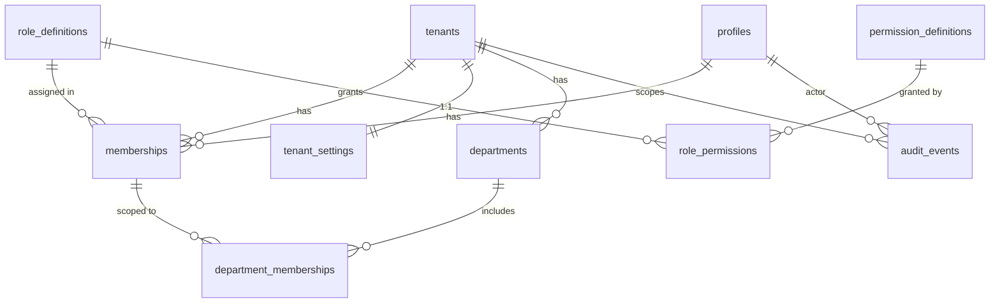

# Data Model — Phase 2 (Tenancy, RBAC, Departments, Audit)

Scope: the multi-tenant security core delivered across Phase 2
([`IMPLEMENTATION_PLAN.md`](IMPLEMENTATION_PLAN.md)) — from `feature/tenant-data-model`
through `security/tenant-rls-policies` and `feature/audit-foundation`. This is the foundation
every later tenant-owned table builds on (rostering, and all bank-staff features in
[`BANK_STAFF_BACKLOG.md`](BANK_STAFF_BACKLOG.md)).

Design authority: [`ARCHITECTURE.md`](ARCHITECTURE.md) — **RLS on every tenant-owned table**,
**SECURITY DEFINER** helper functions for membership/permission checks, **append-only**
`audit_events`, tenant context derived from **memberships** (never a client-supplied
`tenant_id`), and UTC storage with a per-tenant IANA timezone.

Status: **draft for review.** No migrations are written yet (the repo has no `supabase/` dir).

---

## 1. Principles that shape the schema

1. **Deny by default.** RLS is `ENABLE`d on every tenant-owned table **at creation**. A table
   with RLS on and no policy denies all access to the `anon`/`authenticated` roles — safe.
   Policies are then layered in as their dependencies (memberships, helper functions) land, so
   `main` is never in a state where a tenant-owned table is readable cross-tenant.
2. **Isolation in the database, not the app.** Even if application code has a bug, RLS must
   prevent cross-tenant reads/writes. App-layer checks are defence-in-depth, not the primary
   control.
3. **No recursive RLS.** Membership/permission lookups used *inside* policies run through
   `SECURITY DEFINER` functions in a private `app` schema, so a policy on `memberships` can
   check membership without triggering its own policy recursively.
4. **Least exposure.** Helper functions live in schema `app` (not `public`), so PostgREST does
   not expose them as RPC. The **service-role** key (bypasses RLS) is server-only and used only
   for seeding, admin, and audit writes.
5. **Auditability.** Sensitive mutations append to `audit_events`; the table is insert-only.

## 2. Entity overview



| Table | Tenant-owned? | Purpose |
| --- | --- | --- |
| `profiles` | No (per auth user) | App-facing mirror of `auth.users` (name, email, avatar). |
| `tenants` | Root | A workspace/organisation. |
| `tenant_settings` | Yes (1:1) | Per-tenant config / feature flags. |
| `role_definitions` | System or per-tenant | Named roles (owner/admin/manager/scheduler/viewer). |
| `permission_definitions` | No (global) | Atomic permissions. |
| `role_permissions` | No (global/system) | Role → permission grants. |
| `memberships` | Yes | A profile's membership + role in a tenant. |
| `departments` | Yes | Sub-units (wards) within a tenant. |
| `department_memberships` | Yes | Restricts a member to specific departments. |
| `audit_events` | Yes (nullable for system) | Append-only record of sensitive actions. |

## 3. Table definitions

Types are PostgreSQL. All tables get `created_at timestamptz not null default now()`; mutable
tables also get `updated_at` maintained by a shared `set_updated_at()` trigger. IDs are
`uuid default gen_random_uuid()` unless noted.

```sql
-- profiles: one row per auth user, created by a trigger on auth.users insert.
profiles (
  id          uuid primary key references auth.users(id) on delete cascade,
  full_name   text,
  email       text,                       -- denormalised for display
  avatar_url  text,
  created_at, updated_at
)

-- tenants: the workspace. `slug` selects a candidate tenant in the route; membership is verified server-side.
tenants (
  id          uuid primary key,
  slug        text not null unique,
  name        text not null,
  timezone    text not null default 'Europe/Dublin',   -- IANA; drives display + duration math
  status      tenant_status not null default 'active',
  created_by  uuid references profiles(id),
  created_at, updated_at
)

tenant_settings (
  tenant_id           uuid primary key references tenants(id) on delete cascade,
  locale              text not null default 'en-IE',
  timesheets_enabled  boolean not null default false,
  messaging_enabled   boolean not null default false,
  updated_at
)

-- RBAC ------------------------------------------------------------------------
permission_definitions (
  id          uuid primary key,
  key         text not null unique,        -- e.g. 'members.manage', 'roster.edit', 'shift.book'
  description text not null
)

role_definitions (
  id          uuid primary key,
  tenant_id   uuid references tenants(id) on delete cascade,  -- NULL = system role
  key         text not null,               -- 'owner','admin','manager','scheduler','viewer'
  name        text not null,
  is_system   boolean not null default false,
  created_at,
  unique (tenant_id, key)                   -- NULLs distinct → system keys unique globally via partial index
)

role_permissions (
  role_id       uuid references role_definitions(id) on delete cascade,
  permission_id uuid references permission_definitions(id) on delete cascade,
  primary key (role_id, permission_id)
)

memberships (
  id          uuid primary key,
  tenant_id   uuid not null references tenants(id) on delete cascade,
  profile_id  uuid not null references profiles(id) on delete cascade,
  role_id     uuid not null references role_definitions(id),
  status      membership_status not null default 'active',   -- active | suspended | invited
  invited_by  uuid references profiles(id),
  created_at, updated_at,
  unique (tenant_id, profile_id)            -- one membership per user per tenant
)

-- Departments -----------------------------------------------------------------
departments (
  id          uuid primary key,
  tenant_id   uuid not null references tenants(id) on delete cascade,
  name        text not null,
  code        text,
  status      lifecycle_status not null default 'active',
  created_at, updated_at,
  unique (tenant_id, code)
)

department_memberships (
  id            uuid primary key,
  tenant_id     uuid not null references tenants(id) on delete cascade,  -- denormalised for RLS
  department_id uuid not null references departments(id) on delete cascade,
  membership_id uuid not null references memberships(id) on delete cascade,
  created_at,
  unique (department_id, membership_id)
)

-- Audit -----------------------------------------------------------------------
audit_events (
  id          bigint generated always as identity primary key,
  tenant_id   uuid references tenants(id) on delete set null,  -- NULL for system-level events
  actor_id    uuid references profiles(id) on delete set null,
  action      text not null,               -- e.g. 'membership.created'
  entity_type text not null,
  entity_id   uuid,
  metadata    jsonb not null default '{}',
  created_at
)
```

### Enums

```sql
tenant_status    : active | suspended | archived
membership_status: active | suspended | invited
lifecycle_status : active | suspended | archived   -- reused by departments and later tables
```

## 4. RLS & helper functions

Private schema `app` holds `SECURITY DEFINER` functions (owner = a privileged role,
`search_path` pinned, `EXECUTE` granted to `authenticated`). They are the only place that reads
membership/permission data inside a policy, which avoids recursive RLS.

```sql
app.current_profile_id() returns uuid       -- = auth.uid()
app.is_member(tenant uuid) returns boolean   -- active membership in `tenant` for auth.uid()
app.has_permission(tenant uuid, perm text) returns boolean
                                             -- member's role in `tenant` grants `perm`
app.is_department_member(dept uuid) returns boolean
                                             -- member is unrestricted OR linked via department_memberships
```

Policy shape per tenant-owned table:

| Operation | `USING` / `WITH CHECK` |
| --- | --- |
| SELECT | `app.is_member(tenant_id)` (+ `app.is_department_member(department_id)` on dept-scoped tables) |
| INSERT | `WITH CHECK (app.has_permission(tenant_id, '<perm>'))` |
| UPDATE | `USING (app.is_member(tenant_id)) WITH CHECK (app.has_permission(tenant_id, '<perm>'))` |
| DELETE | `USING (app.has_permission(tenant_id, '<perm>'))` |

- `profiles`: self-access (`id = auth.uid()`) for read/update; a member may read the basic
  profile of co-members (via a `SECURITY DEFINER` `app.shares_tenant(profile uuid)` helper).
- `tenants` / `tenant_settings`: readable to members; writable with `tenant.manage`.
- `memberships`: readable to members of the same tenant; writable with `members.manage`.
- `audit_events`: **INSERT-only** — a single INSERT policy, **no** UPDATE/DELETE policy, and
  `REVOKE UPDATE, DELETE` from `authenticated`. Writes go through `app.log_audit(...)`.

### Tenant-context resolution (app layer)

The route slug (`/[tenantSlug]/…`) selects a *candidate* tenant. The server resolves the
authenticated user's **active memberships** and verifies the candidate is among them before any
query — never trusting a client-supplied `tenant_id`. RLS enforces the same invariant at the
database, so the app check is defence-in-depth. Middleware already refreshes the session and
exposes the `User`; tenant resolution is added on top (`src/lib/tenancy`).

## 5. Migration plan

Tooling recommendation: adopt the **Supabase CLI** with SQL migrations under
`supabase/migrations/NNNN_name.sql`, linked to the hosted project and applied via
`supabase db push`. This makes the schema reproducible and reviewable (vs. hand-editing in the
dashboard). Add `supabase/` + `supabase/config.toml` in the first branch.

Migrations map to the Phase 2 branches. Each keeps `main` stable: RLS is enabled at table
creation; member-based policies arrive with the helpers they depend on.

| Order | Branch | Migrations | Contents |
| --- | --- | --- | --- |
| 1 | `feature/tenant-data-model` | `0001_extensions`, `0002_shared` , `0003_profiles`, `0004_tenants` | pgcrypto/citext as needed; `set_updated_at()` trigger fn; `app` schema; enums; `profiles` (+ `handle_new_user` trigger on `auth.users`, self-access RLS); `tenants` + `tenant_settings` with **RLS enabled, deny-by-default** (member policies deferred to step 2). |
| 2 | `feature/tenant-memberships` | `0005_rbac`, `0006_memberships`, `0007_helpers_policies` | `permission_definitions`, `role_definitions`, `role_permissions` (+ seed system roles/permissions); `memberships`; `app.is_member` / `app.has_permission` / `app.shares_tenant`; member/permission policies for `tenants`, `tenant_settings`, `memberships`. |
| 3 | `feature/department-access` | `0008_departments`, `0009_department_policies` | `departments`, `department_memberships`; `app.is_department_member`; dept-scoped policies. |
| 4 | `security/tenant-rls-policies` | `0010_rls_hardening` | Audit pass: confirm every tenant-owned table has complete SELECT/INSERT/UPDATE/DELETE policies and permission-gated writes; tighten `GRANT`s; add negative-path fixtures. |
| 5 | `feature/audit-foundation` | `0011_audit_events` | `audit_events` (insert-only RLS, `REVOKE UPDATE,DELETE`); `app.log_audit()`; minimal write API in `src/lib/audit`. |

`feature/workspace-switcher` (Phase 2) and `test/tenant-isolation-suite` add no core tables:
the former is UI + `src/lib/tenancy` context resolution; the latter is an automated suite that
provisions two tenants + users and asserts **zero** cross-tenant/-department leakage (pgTAP in
CI, and/or app-level integration tests using two authenticated clients).

## 6. Seed data (system roles & permissions)

Ship a fixed set of **system** roles (`role_definitions.is_system = true`, `tenant_id = null`)
and permissions, seeded in `0005_rbac`:

| Role | Key permissions (illustrative) |
| --- | --- |
| `owner` | everything, incl. `tenant.manage`, `members.manage`, `departments.manage` |
| `admin` | `members.manage`, `departments.manage`, `roster.edit`, `reports.view` |
| `manager` | `roster.edit`, `shift.book`, `reports.view` (own departments) |
| `scheduler` | `roster.edit`, `shift.book` |
| `viewer` | read-only (`roster.view`, `reports.view`) |

Permission keys are provisional and will grow with rostering/bank-staff features; keep them in
one seed file as the source of truth.

## 7. Open decisions

1. **Custom roles per tenant** — schema allows `role_definitions.tenant_id` (non-system), but
   MVP likely ships **system roles only**. Confirm before building role-management UI.
2. **Department restriction default** — is a member with **no** `department_memberships`
   treated as *all-departments* (unrestricted) or *no-departments*? Recommend **unrestricted**
   for managers/admins; encode in `app.is_department_member`.
3. **`audit_events` id type** — `bigint identity` (compact, ordered) vs `uuid`. Recommend
   `bigint`; revisit if events must be client-generated.
4. **Supabase CLI adoption** — confirm we add `supabase/` migrations now (recommended) vs.
   deferring migration tooling.
5. **Profiles visibility** — how much of a co-member's profile is visible (name/email vs. name
   only). Affects `app.shares_tenant` policy on `profiles`.

## 8. What this unblocks

Once Phase 2 lands, the bank-staff tables in [`BANK_STAFF_BACKLOG.md`](BANK_STAFF_BACKLOG.md)
§3 (`shift_requests`, `bookings`, `bank_workers`, …) attach to `tenants`/`departments`, inherit
the same RLS pattern (`app.is_member` / `app.has_permission` / `app.is_department_member`), and
write to `audit_events`. No bank-staff table should be created before step 4 above is complete.

---

_Draft 2026-07-16 for Phase 2 scoping. Aligns with `ARCHITECTURE.md`; supersedes nothing yet —
migrations are not written until this design is approved._
